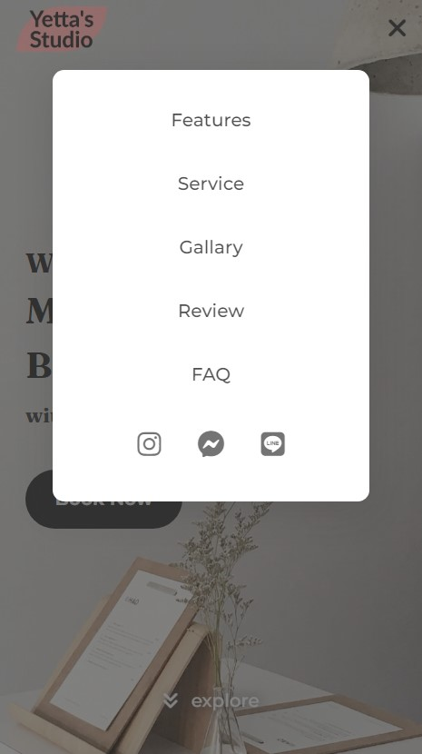

# Product Landing Page - Yetta's Studio

This is a solution to the [FCC | Build a Product Landing Page](https://www.freecodecamp.org/learn/2022/responsive-web-design/build-a-product-landing-page-project/build-a-product-landing-page).

A landing page for a beauty salon that provides beauty services like manicure, eyelashes extension, and skincare.

## Table of contents

- [Overview](#overview)
  - [The challenge](#the-challenge)
  - [Screenshot](#screenshot)
  - [Links](#links)
- [My process](#my-process)
  - [Built with](#built-with)
  - [What I learned](#what-i-learned)
- [Author](#author)

## Overview

### The challenge

**Objective:** Build an app that is functionally similar to https://product-landing-page.freecodecamp.rocks

### Screenshot


 

### Links

- Solution URL: [Repository](https://github.com/GretaLi/Product-Landing-Page/tree/main/Yetta%20Studio)
- Live Site URL: [Yetta's Studio](https://gretali.github.io/Product-Landing-Page/Yetta%20Studio/)

## My process

### Built with

- Semantic HTML5 markup
- SCSS / CSS custom properties
- Flexbox
- Grid
- Mobile-first workflow
- Javascript / jQuery
- Swiper

### What I learned

**Navbar scroll down effect**


```html
<nav id="nav-bar" class="navbar">
  <a href="#" class="nav-logo"
    ></a>
  <ul id="navMenu" aria-expanded="false">
    <li><a href="#features" class="nav-link">Features</a></li>
    <li><a href="#service" class="nav-link">Service</a></li>
    <li><a href="#gallary" class="nav-link">Gallary</a></li>
    <li><a href="#review" class="nav-link">Review</a></li>
    <li><a href="#faq" class="nav-link">FAQ</a></li>
    <li class="social">
      <a href="#" class="social-link"><i class="fa-brands fa-instagram"></i></a>
      <a href="#" class="social-link"
        ><i class="fa-brands fa-facebook-messenger"></i
      ></a>
      <a href="#" class="social-link"><i class="fa-brands fa-line"></i></a>
    </li>
  </ul>
  <button id="navToggle" class="nav-toggle">
    <i id="navToggleIcon" class="fa-solid fa-bars-staggered"></i>
  </button>
</nav>
```

```css
.navbar-bg {
  padding: 0.5rem 1.5rem;
  background: hsl(var(--clr-white));
  box-shadow: 0 5px 15px hsl(var(--clr-dark), 0.2);

  @include sm {
    background: hsl(var(--clr-white), 0.8);
  }
}
```

```jsx
// desktop navbar - white background
const navbar = document.querySelector("#nav-bar");

$(window).scroll(function (event) {
  // console.log($(window).scrollTop());
  if ($(window).scrollTop() > 0) {
    navbar.classList.add("navbar-bg");
  } else {
    navbar.classList.remove("navbar-bg");
  }
});
```

**Background parallax**

```css
.parallax {
  background-attachment: fixed;
  background-position: center;
  background-repeat: no-repeat;
  background-size: cover;
  -webkit-background-size: cover;
  -moz-background-size: cover;
  -o-background-size: cover;
  min-height: 100%;
  position: relative;
}

.bg-img1 {
  background: linear-gradient(rgba(0, 0, 0, 0.3), rgba(0, 0, 0, 0.3)),
    url("https://wallpapercave.com/wp/wp1906348.png");
}
```

## Author

- Website - [Greta Li](https://github.com/GretaLi)
- freeCodeCamp - [Greta Li](https://www.freecodecamp.org/hsinju)
- Frontend Mentor - [@Greta Li](https://www.frontendmentor.io/profile/GretaLi)
